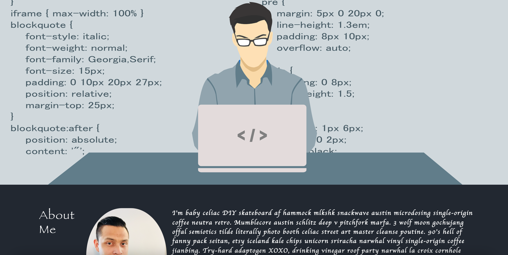

# React SPA Portfolio

[]

## Description: 
A single-page react application to showcase my portfolio to potential employers. Now that I have completed a few projects, I have added them to this portfolio and will continue to work on this and make updates as time goes by. 

## Installation:
* Clone repository here: https://github.com/LunaZ13/react-spa-portfolio and run `npm start` on your local machine. 
* Check out deployed site here: https://lunaz13.github.io/react-spa-portfolio/

## Usage:
A portfolio page for me to keep working on and template for users that are looking to create their own. 

## Contributing:
Feel free to fork project and reach out please.

## Built With:
* HTML
* CSS 
* JavaScript 
* React 

## Credits:
Created by Inmar Luna :grinning:

## License 

Copyright (c) [2022] [Inmar Luna]

Permission is hereby granted, free of charge, to any person obtaining a copy
of this software and associated documentation files (the "Software"), to deal
in the Software without restriction, including without limitation the rights
to use, copy, modify, merge, publish, distribute, sublicense, and/or sell
copies of the Software, and to permit persons to whom the Software is